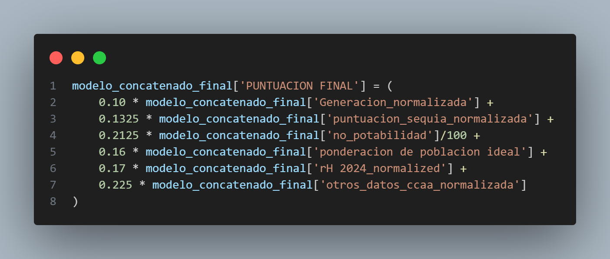

# Where do you sell a machine that makes water out of air?

Ranking Spain's **35,891 census sections** to find the 50 best places to launch
a domestic atmospheric water generator — built for
[GENAQ](https://www.genaq.com/) as the 2025 case study of
Fundación Innovación Bankinter's *Akademia* programme.

[](https://www.python.org/)
[](tests/)
[](LICENSE)

---

## The brief

GENAQ condenses drinking water out of humidity in the air. Their machines are
proven in emergencies and industrial sites; now they want them in homes. The
brief from the CEO was deliberately open:

> *Tell us the first 50 census sections in Spain where we should sell this.*

A census section is the INE's smallest statistical unit — roughly 1,000–2,500
people, a few streets. Picking 50 of them out of ~36,000 is the whole problem,
and there is no labelled outcome to train on: nobody has sold this product to a
Spanish household yet. So this isn't a prediction task. It's a **ranking problem
where the target has to be argued for from first principles.**

## The bet

A household buys a water machine when three things are true at once. It has to
be **worth it** (tap water is hard, unpleasant or unreliable, so they already
buy bottled), it has to be **affordable** (income), and it has to **work well**
(enough humidity for good yield). Everything below is an attempt to measure
those three from public data.

## The result

50 sections, ranked. Top 10:

| # | Census section | Municipality | Region | Score |
|---:|---|---|---|---:|
| 1 | 4302301001 | Bellmunt del Priorat | Cataluña | 0.641 |
| 2 | 1701502001 | Banyoles | Cataluña | 0.632 |
| 3 | 0829501009 | Vallirana | Cataluña | 0.631 |
| 4 | 0829501006 | Vallirana | Cataluña | 0.630 |
| 5 | 0829501008 | Vallirana | Cataluña | 0.630 |
| 6 | 0829501005 | Vallirana | Cataluña | 0.630 |
| 7 | 0829501003 | Vallirana | Cataluña | 0.630 |
| 8 | 0829501002 | Vallirana | Cataluña | 0.629 |
| 9 | 0829501001 | Vallirana | Cataluña | 0.629 |
| 10 | 1701502005 | Banyoles | Cataluña | 0.628 |

Full ranking: [`results/top_50_secciones.csv`](results/top_50_secciones.csv) ·
all 35,891 scored: [`results/ranking_secciones.csv`](results/ranking_secciones.csv)

The 50 land in **12 municipalities**, 47 in Cataluña and 3 in Andalucía
(Viator, Almería — the hardest tap water in the country at 1,391 mg/L CaCO₃).
That concentration is partly a real signal and partly an artefact of the model;
[Limitations](#limitations) is honest about which is which.

## The scoring model

Every section gets a score in [0, 1] from six normalised drivers:

```
PUNTUACION_FINAL =
    0.2250 × regional water context      (bottled-water use, water stress)
  + 0.2125 × no_potabilidad              (how bad the tap water is)
  + 0.1700 × household income            (can they pay for it)
  + 0.1600 × demographic fit             (is this the right kind of household)
  + 0.1325 × drought pressure            (reservoirs + SPI stations)
  + 0.1000 × machine yield               (litres/day in that climate)
```

Weights live in [`src/config.py`](src/config.py) and are asserted to sum to 1.0.
They were set by the team, not fitted — with no ground truth to fit against,
pretending otherwise would be false precision. The ordering encodes the bet:
**water you don't want to drink matters more than water you can't afford**,
and both matter more than how efficiently the machine runs.

Two of the six deserve explanation.

**`no_potabilidad` (0–100)** — how *unsuitable* a municipality's tap water is,
which is what makes a household a prospect. Built from SINAC's national register
by checking each of 57 parameters against its legal limit (RD 3/2023), then
penalising hardness (65%), pH deviation (20%) and out-of-spec rate (15%).
Hardness dominates deliberately: it is what actually drives people to buy
bottled water. Water between 150–500 mg/L CaCO₃ is unpenalised; above that the
penalty saturates exponentially, below it grows linearly, because water that is
too soft is aggressive rather than better.

**Regional context** — bottled-water demand and non-potable share scaled by
regional population, plus water stress on its own:

```
otros_datos_ccaa = poblacion_norm × (0.55 × bottled_use + 0.225 × non_potable)
                                  +  0.225 × water_stress
```

A thirsty region with nobody in it is not a market, so the demand terms scale
with population. Water stress describes the supply side regardless of headcount,
so it enters flat.

## How it works

```
        AEMET SPI            MITECO reservoirs         SINAC analyses
     (85 stations,          (weekly, 1988–2025)       (57 parameters)
      1–24m windows)                 │                        │
            │                        │                        │
            └──────► src/sequia.py ◄─┘                src/calidad_agua.py
                     drought score                    no_potabilidad 0–100
                          │                                   │
                          └───────────► municipality ◄────────┘
                                             │
                            INE income + demographics
                                             │
                                    src/modelo.py
                                  weighted sum → rank
                                             │
                                   results/top_50.csv
```

The tricky part is that the data lives at four different grains — region,
province, municipality, census section — and only the section grain is what the
CEO asked about. Everything is joined **downward** onto sections: municipal
indicators via `(CPRO, CMUN)`, regional ones via `CODAUTO`. Municipal keys join
at 100% coverage; drought reaches 92.7% of sections.

Linking municipalities to reservoirs needed care. Straight-line distance happily
connects Ibiza to a mainland reservoir across open sea, so islands and the North
African enclaves are matched only within their own bounding box. The radius
starts at 50 km and widens to 75, 100 and 160 km, but **only for municipalities
the previous pass left unmatched** — a town next to a reservoir shouldn't have
its score diluted by one 160 km away.

## Quickstart

```bash
git clone https://github.com/<you>/genaq-market-selection.git
cd genaq-market-selection
pip install -r requirements.txt

python -m src.modelo          # writes results/, prints the top 10
pytest -q                     # 56 tests
```

The processed data is committed (~5 MB), so the model runs on a fresh clone with
no downloads and no API key. Rebuilding from raw sources needs both — see
[`data/README.md`](data/README.md).

```
src/
  config.py         paths, weights, thresholds — every tunable in one place
  modelo.py         joins the grains, applies the weights, ranks       ← start here
  calidad_agua.py   SINAC analyses  → no_potabilidad
  sequia.py         reservoirs + SPI → drought score
  geocoding.py      Google Maps lookups, cached
tests/              56 tests
data/processed/     committed inputs (~5 MB)
results/            the ranking
notebooks/          exploration
```

## Limitations

The model shipped and the reasoning holds, but the numbers have four problems I
would not leave in a second version. They're documented here rather than quietly
fixed, because the committed data is what the 2025 submission actually used.

**1. Drought carries 13% of the weight and delivers almost none.**
`puntuacion_sequia` is wildly skewed — median 0.09, mean 1.23, max 124.8.
Min-max scaling maps that long tail onto [0, 1], so **95% of sections land below
0.05** and the median section gets 0.1% of the score from a driver nominally
worth 13.25%. The variable is, in practice, switched off. A rank transform or a
log would have kept its signal.

**2. The regional term decides the answer.**
`ccaa_norm` has both the largest weight (22.5%) and only 19 distinct values, and
Cataluña scores exactly 1.0 on it. Every Catalan section starts with a flat
+0.225 head start, while **the entire top 50 fits inside a band of 0.071**. For
most regions the gap to Cataluña is 0.14–0.22 — twice that band — so a section
elsewhere has to beat a Catalan one on the other five drivers by more than the
whole spread of the ranking, purely to offset a term that says nothing about the
section itself. That is why 47 of the top 50 are Catalan: the model effectively
**picks a region first and sorts within it**. Only Viator gets through, on the
hardest tap water in Spain. Whether that's the right call is a business question
— but it should be a decision, not a side effect of a weight.

**3. The gap-filling model is weak.**
1,537 municipalities never published water analyses, so `no_potabilidad` was
predicted for them with a Random Forest over geography alone (lat, lon, a
20-cluster KMeans label, distance to Madrid). It scores **R² = 0.289, RMSE =
9.92** — spatial interpolation with a tree, not a real model of water chemistry.
It is fit for ordering candidates, not for quoting a number about any one town.
The saving grace: **all 50 selected sections rest on measured water quality**,
so no recommendation depends on a predicted value.

**4. The top 50 is not a route.**
Sixteen of the fifty are in Sant Cugat del Vallès and twelve in Banyoles. If the
goal is a launch corridor that's efficient; if it's a national footprint it isn't.
Nothing in the model expresses that preference either way.

### A bug worth keeping

The SPI intensity score escalates ×1 / ×2 / ×3 as drought crosses −1.0, −1.5 and
−2.0. Except it never did:

```python
for umbral, mult in zip([-1.0, -1.5, -2.0], [1, 2, 3]):
    if spi_min <= umbral:
        intensidad = abs(spi_min) * mult
        break            # ← always fires on the first threshold
```

The candidate list only ever contains SPI ≤ −1, so `spi_min <= -1.0` is true by
construction, `break` fires immediately and **×2 and ×3 are unreachable**. Every
station scored ×1 and the escalation was decorative.

Fixing it moves **68 of 85 stations**, which would silently diverge from the
data the submission was built on. So it sits behind
`SPI_CONFIG["escalada_intensidad"]`, defaulting to `False` — the repo reproduces
what was presented, and the fix is one flag away. Verified: the reconstruction
matches the original station scores to 1.4e-14, and `no_potabilidad` to 0.0
across all 7,144 municipalities.

## Beyond the algorithm

The brief also asked what else GENAQ could offer, so the deck proposed:

- **Route optimisation** — a TSP over the 50 sections to cut the commercial
  team's fuel and travel time.
- **IoT telemetry** — pH, turbidity, TDS, humidity, energy draw; a friendly
  dashboard plus consumption forecasting from household habits.
- **Remote diagnostics** — ship self-tests to HQ so servicing is scheduled
  before the customer notices a fault.
- **Solar bundling** — sell alongside photovoltaic installers, so the water is
  effectively free to run and both products amortise faster.
- **Leasing with a purchase option** — €354/year at a 20% margin, lowering the
  entry barrier versus a large upfront cost.

Channel: El Corte Inglés plus local dealers, with Facebook Ads geotargeted to
25–65 year olds in the selected municipalities.

## What I'd do differently

Rank-transform the drought variable so its weight means something. Reconsider
whether a 19-value regional term deserves the largest weight when it
mechanically decides the winning region. Replace the geography-only Random
Forest with something that uses the actual drivers of water chemistry — aquifer
type, source, treatment — or drop the imputation and report coverage honestly.
And run a sensitivity analysis: with weights set by judgement rather than fitted,
the right question isn't "what's the top 50" but **"how much do the weights have
to move before the top 50 changes?"** That analysis is missing, and it's the
first thing I'd add.

## Context

Built for the *Akademia* programme of
[Fundación Innovación Bankinter](https://www.fundacionbankinter.org/), Nov 2024 –
Feb 2025, by a deliberately multidisciplinary team of four: data science,
computer engineering, industrial engineering, and law + business.
My part was the data pipeline and the scoring model.

This repository is a **reconstruction**. The original work was ~2,000 lines of
exploratory notebooks with hardcoded local paths, four copies of the same
distance function, a live API key, and a final model that survived only as this
screenshot:



That image was the entire specification of the scoring step — no code, no
output file. [`src/modelo.py`](src/modelo.py) is it, rebuilt and runnable. The
analysis is the team's; the packaging, the tests, the bug archaeology and the
honesty about the limitations are mine, added after the fact.

Data from MITECO, AEMET, SINAC and INE, all public. Not affiliated with GENAQ.

## License

[MIT](LICENSE). The public source data keeps its own terms.
